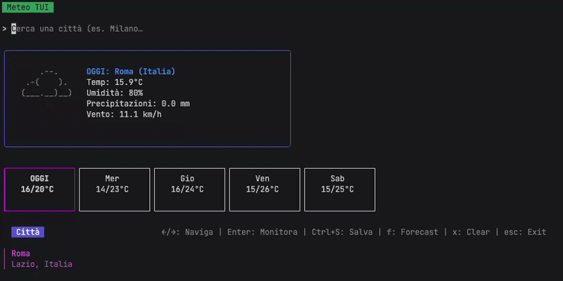
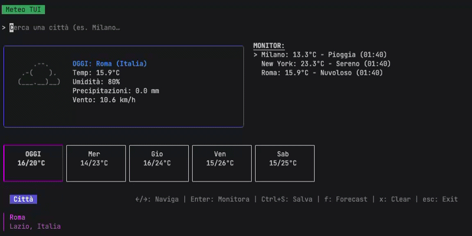

# Presentazione del Progetto: Meteo TUI

## Riassunto del Progetto
Meteo TUI è un'applicazione terminale scritta in Go che permette la consultazione del meteo in modo rapido e immediato. Il progetto sfrutta le API pubbliche di Open-Meteo per fornire dati accurati senza richiedere agli utenti chiavi API personali o configurazioni complesse.

L'app è costruita sul framework Charmbracelet (Bubble Tea), che gestisce l'interfaccia testuale in modo efficiente. Gli utenti possono cercare città in tutto il mondo, visualizzare le condizioni correnti (temperatura, umidità, vento) e consultare le previsioni per i successivi 5 giorni, il tutto accompagnato da icone in ASCII art. Un sistema di caching basato su SQLite memorizza le risposte localmente, evitando di fare chiamate API superflue e garantendo risposte istantanee. L'app rileva automaticamente la lingua di sistema, supportando Italiano e Inglese.

## Descrizione delle Funzionalità
1. **TUI Interattiva**: Un'interfaccia grafica nel terminale con barra di ricerca, autocompletamento e navigazione tramite frecce direzionali.
2. **Quick Launch**: Una modalità rapida che restituisce i dati meteo direttamente sulla riga di comando senza avviare l'interfaccia interattiva.
3. **Modalità List**: Permette di avviare l'applicazione pre-caricando una lista specifica di città per un monitoraggio veloce.

## Dimostrazione Visiva
### Ricerca Città e Autocompletamento

*Barra di ricerca interattiva con sistema di debounce per suggerimenti in tempo reale.*

### Monitoraggio Multi-Città

*Gestione della lista delle città monitorate e navigazione tra le previsioni giornaliere.*

## Metodologia: Uso dell'IA
L'intelligenza artificiale è stata utilizzata come supporto tecnico per accelerare lo sviluppo e migliorare la struttura del progetto. È stata particolarmente utile per:
- **Scrittura di Boilerplate e Test**: Generazione di strutture dati ripetitive e creazione di una suite di test unitari completa.
- **Risoluzione di Bug**: Supporto nel debug della logica asincrona del framework e nel raffinamento del layout grafico con la libreria Lip Gloss.
- **Documentazione**: Assistenza nella stesura del README e nell'organizzazione dei commenti per rendere il codice più leggibile.

## Riflessioni e Apprendimenti
La sfida principale è stata la gestione della UI nel terminale, assicurando che i bordi e i contenuti rimanessero allineati nonostante la variabilità delle icone ASCII. Imparare l'architettura di Bubble Tea è stato molto utile per capire come gestire lo stato di un'applicazione in modo deterministico. Sono soddisfatto del sistema di caching SQLite, che rende l'app reattiva riducendo il traffico di rete. Come sviluppo futuro, implementerei un sistema di notifiche per le allerte meteo e la possibilità di personalizzare i colori dell'interfaccia tramite un file di configurazione esterno.
